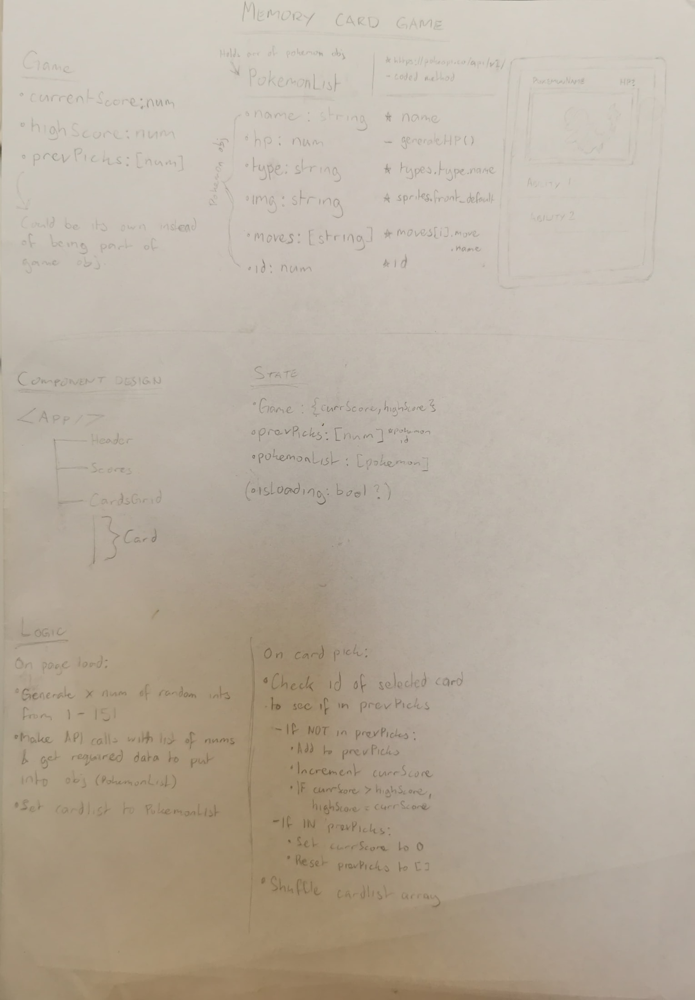

# Memory Card Game

A Pokemon based memory card game built with React, JavaScript & Vite. This project was made to further develop the React skills learned so far.

- [Visit the preview](https://nimble-cocada-db557e.netlify.app/)
- Utilises the [PokeAPI](https://pokeapi.co/)

## Technologies Used

- Vite
- React
- JavaScript
- CSS

## Installation

1. **Clone the repository**:

   ```bash
   git clone https://github.com/ishmyles/memory-card-game.git
   cd memory-card-game
   ```

2. **Install dependencies**:

   ```bash
   npm install
   ```

3. **Start the application**:

   ```bash
   npm run dev
   ```

   The app will be accessible at `http://localhost:5173`.

4. **Terminating the application**:

   Press Ctrl + C to terminate app.

## App Design


